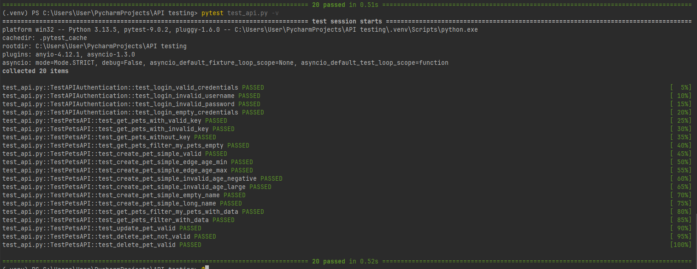

# Лабораторная работа 4

Лабораторная работа: Тестирование REST API с использованием фреймворка pytest

Цель работы:

    - Ознакомиться с тестовым фреймворком pytest.

    - Реализовать методы API.

    - Разработать и реализовать дополнительные тест-кейсы для REST API.

Часть 1: Реализация недостающих методов API

    1. Изучите документацию API, доступную на сайте.

    2. Реализуйте их в файле api.py.

Часть 2: Разработка и написание тест-кейсов

    1. Напишите 20 тестов с использованием pytest.

        - Включите тесты на граничные значения параметров.

        - Добавьте тесты с некорректными данными.

        - Проверьте обработку неверных авторизационных данных.

        - Учтите возможные ошибки со стороны сервера.

    2. Разместите тесты в файле test_api.py.

Часть 3: Размещение на GitHub

    1. Создайте новый репозиторий на GitHub или используйте существующий.

    2. Добавьте файлы api.py и test_api.py в репозиторий.

    3. Отправьте ссылку на репозиторий для проверки.

